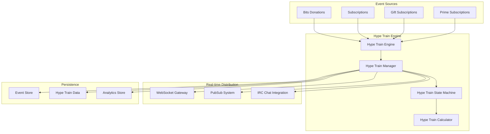

# Hype Train Architecture & Mechanics

## Overview

Hype Trains are Twitch's real-time engagement mechanic that transforms viewer contributions (bits, subscriptions, gifted subs) into a gamified, time-limited event that amplifies community excitement and drives monetization through social momentum.

## Component Details
- **Domain**: Engagement & Gamification
- **Type**: Event-Driven Backend Service
- **Integration**: Chat, Commerce, Real-time Messaging
- **Scale**: Channel-level events with platform-wide aggregation
- **Technology**: Event-driven architecture with WebSocket distribution

## Architecture Overview

### Core Components



## Core Mechanics

### 1. Hype Train Lifecycle

#### Activation Phase
- **Trigger Threshold**: Configurable contribution velocity threshold
- **Kickoff Period**: 5-minute rolling window for initial contributions
- **Minimum Threshold**: Varies by channel size and historical data
- **Auto-Start Logic**:
  ```rust
  fn should_start_hype_train(
      contributions: &[Contribution],
      channel_stats: &ChannelStats,
      window_minutes: u32
  ) -> bool {
      let recent_value = calculate_recent_value(contributions, window_minutes);
      let threshold = calculate_dynamic_threshold(channel_stats);
      recent_value >= threshold
  }
  ```

#### Active Phase
- **Duration**: 5 minutes base + extensions
- **Extension Logic**: Each level progression adds 30 seconds
- **Max Duration**: 8 minutes total
- **Level Progression**: 5 levels with exponential thresholds

#### Completion/Cooldown Phase
- **Success State**: Reached level 5 or sustained high engagement
- **Cooldown Period**: 10 minutes minimum between trains
- **Celebration Window**: 30 seconds of fireworks/effects

### 2. Contribution Value System

#### Point Calculation Matrix
```rust
pub struct ContributionPoints {
    pub bits_multiplier: f64,        // 1 bit = 1 point (base)
    pub tier1_sub_value: u32,        // 500 points
    pub tier2_sub_value: u32,        // 1000 points  
    pub tier3_sub_value: u32,        // 2500 points
    pub gift_sub_multiplier: f64,    // 1.5x multiplier
    pub prime_sub_value: u32,        // 300 points
}

impl Default for ContributionPoints {
    fn default() -> Self {
        Self {
            bits_multiplier: 1.0,
            tier1_sub_value: 500,
            tier2_sub_value: 1000,
            tier3_sub_value: 2500,
            gift_sub_multiplier: 1.5,
            prime_sub_value: 300,
        }
    }
}
```

#### Dynamic Value Adjustments
- **Channel Size Scaling**: Larger channels require proportionally higher thresholds
- **Historical Performance**: Based on channel's past hype train frequency
- **Time-based Modifiers**: Weekend/peak hour bonuses
- **Community Events**: Special multipliers during platform events

### 3. Level Progression System

#### Level Thresholds (Base Configuration)
```rust
pub const HYPE_TRAIN_LEVELS: [HypeTrainLevel; 5] = [
    HypeTrainLevel { level: 1, threshold: 1000,  reward_emote: "Kappa", celebration: "Level1" },
    HypeTrainLevel { level: 2, threshold: 2500,  reward_emote: "PogChamp", celebration: "Level2" },
    HypeTrainLevel { level: 3, threshold: 5000,  reward_emote: "5Head", celebration: "Level3" },
    HypeTrainLevel { level: 4, threshold: 10000, reward_emote: "EZ", celebration: "Level4" },
    HypeTrainLevel { level: 5, threshold: 20000, reward_emote: "5Head", celebration: "Champion" },
];
```

#### Level Benefits
- **Emote Unlocks**: Temporary access to special emotes (duration varies)
- **Badge Progression**: Temporary hype train participant badges
- **Visual Effects**: Progressive enhancement of chat/overlay effects
- **Community Rewards**: Potential for streamer-defined rewards

## Real-Time Event Processing

### Event Flow Architecture

```rust
#[derive(Debug, Clone)]
pub enum HypeTrainEvent {
    ContributionReceived {
        channel_id: u64,
        user_id: u64,
        contribution_type: ContributionType,
        value: u32,
        timestamp: DateTime<Utc>,
    },
    LevelProgressed {
        channel_id: u64,
        new_level: u8,
        total_progress: u32,
        timestamp: DateTime<Utc>,
    },
    TrainStarted {
        channel_id: u64,
        initial_contributions: Vec<Contribution>,
        estimated_end_time: DateTime<Utc>,
    },
    TrainEnded {
        channel_id: u64,
        final_level: u8,
        total_value: u32,
        duration: Duration,
        participants: u32,
    },
}
```

### State Management

```rust
#[derive(Debug, Clone)]
pub struct HypeTrainState {
    pub channel_id: u64,
    pub current_level: u8,
    pub total_progress: u32,
    pub level_progress: u32,
    pub participants: HashSet<u64>,
    pub start_time: DateTime<Utc>,
    pub end_time: DateTime<Utc>,
    pub contributions: Vec<TimestampedContribution>,
    pub is_active: bool,
    pub cooldown_until: Option<DateTime<Utc>>,
}

impl HypeTrainState {
    pub fn process_contribution(&mut self, contribution: Contribution) -> Vec<HypeTrainEvent> {
        let mut events = Vec::new();
        
        // Add points and track participant
        self.total_progress += contribution.points;
        self.participants.insert(contribution.user_id);
        self.contributions.push(TimestampedContribution::now(contribution));
        
        // Check for level progression
        if let Some(new_level) = self.calculate_level_progression() {
            self.current_level = new_level;
            self.extend_duration(); // Add 30 seconds
            events.push(HypeTrainEvent::LevelProgressed {
                channel_id: self.channel_id,
                new_level,
                total_progress: self.total_progress,
                timestamp: Utc::now(),
            });
        }
        
        events
    }
}
```

## Integration Points

### Chat System Integration
- **Real-time Announcements**: Level progression messages in chat
- **Emote Activation**: Temporary emote unlocks during active trains
- **Visual Effects**: Chat animation triggers and overlays
- **Participation Tracking**: User contribution acknowledgments

### Commerce System Integration
- **Transaction Monitoring**: Real-time bits/subscription event processing
- **Value Calculation**: Dynamic point assignment based on transaction type
- **Fraud Prevention**: Anti-spam measures for rapid-fire contributions
- **Payment Validation**: Ensuring legitimate transactions before point assignment

### Analytics & Insights
- **Performance Metrics**: Train frequency, average level reached, participation rates
- **Revenue Impact**: Correlation analysis between trains and revenue spikes
- **Community Health**: Engagement metrics and retention analysis
- **Optimization Data**: Threshold tuning based on performance data

## Data Models

### Database Schema

```sql
-- Hype Train Sessions
CREATE TABLE hype_train_sessions (
    id BIGINT PRIMARY KEY,
    channel_id BIGINT NOT NULL,
    start_time TIMESTAMP NOT NULL,
    end_time TIMESTAMP,
    final_level SMALLINT,
    total_progress INTEGER,
    participant_count INTEGER,
    total_revenue_cents INTEGER,
    status hype_train_status NOT NULL DEFAULT 'active',
    created_at TIMESTAMP DEFAULT NOW(),
    INDEX idx_channel_time (channel_id, start_time),
    INDEX idx_status_time (status, start_time)
);

-- Individual Contributions
CREATE TABLE hype_train_contributions (
    id BIGINT PRIMARY KEY,
    session_id BIGINT NOT NULL,
    user_id BIGINT NOT NULL,
    contribution_type contribution_type_enum NOT NULL,
    raw_value INTEGER NOT NULL,        -- bits count, sub tier, etc.
    calculated_points INTEGER NOT NULL, -- converted to hype train points
    timestamp TIMESTAMP NOT NULL,
    transaction_id VARCHAR(64),         -- link to payment system
    FOREIGN KEY (session_id) REFERENCES hype_train_sessions(id),
    INDEX idx_session_time (session_id, timestamp),
    INDEX idx_user_contributions (user_id, timestamp)
);

-- Level Progression Events
CREATE TABLE hype_train_levels (
    id BIGINT PRIMARY KEY,
    session_id BIGINT NOT NULL,
    level_reached SMALLINT NOT NULL,
    progress_at_level INTEGER NOT NULL,
    timestamp TIMESTAMP NOT NULL,
    duration_extended_seconds INTEGER DEFAULT 30,
    FOREIGN KEY (session_id) REFERENCES hype_train_sessions(id),
    INDEX idx_session_level (session_id, level_reached)
);
```

### Event Sourcing Schema

```rust
#[derive(Serialize, Deserialize)]
pub struct HypeTrainEventRecord {
    pub event_id: Uuid,
    pub channel_id: u64,
    pub session_id: Option<u64>,
    pub event_type: String,
    pub event_data: serde_json::Value,
    pub timestamp: DateTime<Utc>,
    pub sequence_number: u64,
    pub metadata: EventMetadata,
}

#[derive(Serialize, Deserialize)]
pub struct EventMetadata {
    pub source_ip: Option<String>,
    pub user_agent: Option<String>,
    pub correlation_id: String,
    pub causation_id: Option<String>,
}
```

## Performance Considerations

### Scalability Architecture

#### Horizontal Scaling
- **Channel-based Sharding**: Distribute channels across multiple hype train processors
- **Event Stream Partitioning**: Partition events by channel ID for parallel processing
- **Cache Layer**: Redis cluster for real-time state management
- **Load Balancing**: Geographic distribution based on streamer location

#### Real-time Processing
- **Event Latency SLA**: Sub-100ms processing from contribution to UI update
- **WebSocket Connection Management**: Efficient fan-out for large channels
- **Rate Limiting**: Anti-spam protection without impacting legitimate contributions
- **Circuit Breaker**: Graceful degradation during high-load periods

### Database Optimizations
- **Time-series Partitioning**: Partition tables by month for historical data
- **Hot Data Caching**: Active session state in Redis with MySQL persistence
- **Read Replicas**: Separate analytics queries from real-time operations
- **Archival Strategy**: Move completed sessions to cold storage after 90 days

## Security & Anti-Abuse

### Fraud Prevention
```rust
pub struct ContributionValidator {
    rate_limiter: RateLimiter,
    fraud_detector: FraudDetector,
    payment_validator: PaymentValidator,
}

impl ContributionValidator {
    pub async fn validate_contribution(
        &self,
        contribution: &Contribution,
        user_history: &UserHistory,
    ) -> Result<ValidationResult, ValidationError> {
        // Rate limiting check
        self.rate_limiter.check_user_rate(contribution.user_id)?;
        
        // Fraud pattern detection
        if self.fraud_detector.is_suspicious(contribution, user_history)? {
            return Ok(ValidationResult::Flagged);
        }
        
        // Payment system validation
        if let Some(transaction_id) = &contribution.transaction_id {
            self.payment_validator.verify_transaction(transaction_id).await?;
        }
        
        Ok(ValidationResult::Valid)
    }
}
```

### Anti-Manipulation Measures
- **Velocity Limits**: Maximum contribution frequency per user
- **Pattern Detection**: Identify coordinated artificial inflation attempts
- **Payment Verification**: Ensure all contributions are backed by valid transactions
- **Account Requirements**: Minimum account age/standing for participation

## Monitoring & Observability

### Key Metrics
- **Train Frequency**: Trains per hour/day per channel segment
- **Completion Rate**: Percentage of trains reaching level 5
- **Average Participation**: Users per train by channel size
- **Revenue Correlation**: Revenue lift during and after trains
- **Performance Metrics**: Event processing latency, error rates

### Alerting Thresholds
- **Processing Latency**: > 200ms average over 5 minutes
- **Error Rate**: > 0.1% of events failing processing
- **Memory Usage**: > 80% on any hype train processor
- **Fraud Detection**: Unusual contribution patterns exceeding baseline

### Dashboards
1. **Real-time Operations**: Active trains, processing rates, system health
2. **Business Analytics**: Revenue impact, engagement metrics, conversion rates  
3. **Platform Health**: Infrastructure metrics, error tracking, performance trends

## Migration Strategy

### Cross-Platform Reuse (90% Potential)
- **Core Logic**: Event processing, level calculation, and state management
- **Configuration**: Channel-specific thresholds and reward structures
- **Integration Adapters**: Platform-specific payment and chat system connectors
- **UI Components**: Reusable real-time visualization components

### Rust Implementation Benefits
- **Memory Safety**: Eliminate memory leaks in high-frequency event processing
- **Performance**: Significant latency reduction for real-time updates
- **Concurrency**: Superior handling of concurrent channel processing
- **Type Safety**: Prevent runtime errors in contribution calculations

### Migration Phases
1. **Phase 1**: Core event processing engine (Rust)
2. **Phase 2**: State management and persistence layer
3. **Phase 3**: Real-time distribution and WebSocket handling
4. **Phase 4**: Analytics and reporting system
5. **Phase 5**: Administrative tools and configuration management

## Related Components
- [[../../Chat/Backend/chat]] - Real-time chat integration
- [[../../Commerce/Backend/commerce]] - Payment processing integration
- [[../../Identity/Backend/identity]] - User authentication and authorization
- [[../../../../RUST CONVERSION/Components/Chat-Service]] - Chat service migration
- [[../../../../RUST CONVERSION/Components/Bot-Framework]] - Automated engagement features

## Documentation Status
✅ **Complete** - Comprehensive architecture and mechanics documentation

## Technical Specifications

### API Endpoints

#### WebSocket Events
```typescript
// Client -> Server
interface HypeTrainSubscription {
  type: 'SUBSCRIBE_HYPE_TRAIN';
  channel_id: number;
}

// Server -> Client  
interface HypeTrainUpdate {
  type: 'HYPE_TRAIN_UPDATE';
  channel_id: number;
  level: number;
  progress: number;
  level_progress: number;
  time_remaining: number;
  recent_contributions: Contribution[];
}
```

#### REST API
```http
GET /api/hype-trains/channel/{channel_id}/current
GET /api/hype-trains/channel/{channel_id}/history?limit=10&offset=0
POST /api/hype-trains/channel/{channel_id}/configure
```

### Configuration Management
```rust
#[derive(Deserialize, Serialize)]
pub struct HypeTrainConfig {
    pub enabled: bool,
    pub level_thresholds: [u32; 5],
    pub contribution_multipliers: ContributionMultipliers,
    pub duration_base_minutes: u32,
    pub duration_extension_seconds: u32,
    pub cooldown_minutes: u32,
    pub max_level: u8,
}

#[derive(Deserialize, Serialize)]
pub struct ContributionMultipliers {
    pub bits: f64,
    pub tier1_sub: f64,
    pub tier2_sub: f64, 
    pub tier3_sub: f64,
    pub gift_multiplier: f64,
}
```

---

<!-- CODE_ANNOTATION: Created comprehensive hype train backend architecture documentation including:
  - Event-driven processing system with Rust implementations
  - Real-time WebSocket distribution mechanisms
  - Database schemas for sessions, contributions, and level progression
  - Anti-fraud validation and security measures
  - Performance optimization strategies for high-scale deployment
  - Migration strategy with 90% cross-platform reuse potential
  Added: August 29, 2025 by Platform Architecture Team -->

*Architecture analysis completed for Platform Architecture Team*
*Last updated: August 29, 2025*
*Next review: September 15, 2025*
