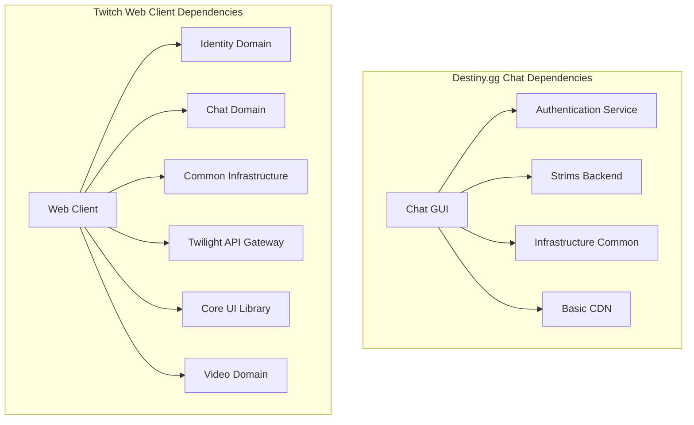

# Chat GUI (Strims Chat)

## Purpose

**Category**: Essential

The Chat GUI serves as **destiny.gg's real-time chat frontend**, providing the interactive messaging interface for viewers and community members. Built as a React-based web application, it handles message rendering, user interactions, moderation controls, and real-time synchronization with the chat backend services.

This component is essential for community engagement, enabling thousands of concurrent users to participate in live discussions, receive notifications, and interact with streamers and moderators through a rich, responsive interface.

## Key Files & Structure

```
/home/cinder/Documents/destiny.gg/chat-gui/ (Frontend Layer)
├── src/
│   ├── components/          # React UI components
│   │   ├── chat/           # Core chat interface
│   │   │   ├── ChatWindow.jsx     # Main chat display
│   │   │   ├── MessageList.jsx    # Message rendering
│   │   │   ├── UserList.jsx       # Online users sidebar
│   │   │   └── InputBox.jsx       # Message composition
│   │   ├── moderation/     # Moderation interface
│   │   │   ├── ModPanel.jsx       # Moderator controls
│   │   │   ├── UserInfo.jsx       # User profile modal
│   │   │   └── BanDialog.jsx      # Ban/timeout interface
│   │   ├── notifications/  # System notifications
│   │   └── settings/       # User preferences
│   ├── services/           # Frontend services
│   │   ├── websocket.js    # WebSocket connection management
│   │   ├── auth.js         # Authentication service
│   │   ├── api.js          # HTTP API client
│   │   └── storage.js      # Local storage management
│   ├── styles/            # CSS/SCSS styling
│   │   ├── themes/        # Light/dark themes
│   │   ├── components/    # Component-specific styles
│   │   └── globals/       # Global styling
│   └── utils/             # Helper utilities
│       ├── message-parser.js  # Message formatting
│       ├── emoji-handler.js   # Emoji processing
│       └── user-utils.js      # User-related utilities
├── public/                # Static assets
│   ├── emoji/            # Emoji sprite sheets
│   ├── sounds/           # Notification sounds
│   └── icons/            # UI icons
├── config/               # Build configuration
├── tests/                # Frontend test suites
└── package.json          # Node.js dependencies
```

## Interfaces

### User Interface Components
- **Message Display**: Real-time message rendering with rich formatting
- **User Interactions**: Click-to-mention, user info popups, message reactions
- **Moderation Tools**: Ban/timeout buttons, message deletion, user history
- **Theme System**: Light/dark mode support with customizable colors
- **Responsive Design**: Mobile-friendly layout with touch interactions

### WebSocket Communication
- **Message Streaming**: Real-time message ingestion via WebSocket
- **User Presence**: Online/offline status updates
- **Moderation Events**: Real-time ban/timeout notifications
- **System Messages**: Server announcements and status updates

### API Integration
- **Authentication**: OAuth integration with destiny.gg login system
- **User Management**: Profile data, permissions, settings
- **Message History**: Paginated chat log retrieval
- **Moderation API**: Ban/timeout management, user lookup

### Browser APIs
- **Local Storage**: User preferences, chat history caching
- **Notifications**: Browser notifications for mentions/highlights
- **Audio**: Sound notifications for various events
- **Clipboard**: Copy message/user functionality

## Depends On

### Core Dependencies
- **[[destiny.gg Docs/Components/Essential/Web/Backend/strims]]** - Chat backend services and WebSocket server
- **[[destiny.gg Docs/Components/Essential/Web/Backend/authentication]]** - User authentication and session management
- **[[destiny.gg Docs/Components/Essential/Infrastructure/infrastructure-common]]** - Shared utilities and deployment infrastructure

### Frontend Stack
- **React** - Primary UI framework (v18+)
- **TypeScript** - Type-safe JavaScript development
- **WebSocket Client** - Real-time communication with chat backend
- **Webpack** - Module bundling and build tooling
- **SCSS** - Advanced CSS preprocessing

### External Services
- **destiny.gg Auth** - OAuth provider for user authentication
- **CDN Services** - Static asset delivery (emoji, themes, sounds)
- **Browser APIs** - WebSocket, LocalStorage, Notifications

## Used By

### User-Facing Applications
- **destiny.gg Website** - Embedded chat widget on main streaming page
- **Mobile Web Client** - Responsive chat interface for mobile users
- **Pop-out Chat** - Standalone chat window for multi-monitor setups

### Administrative Tools
- **Moderation Dashboard** - Enhanced moderation interface for moderators
- **Analytics Dashboard** - Chat engagement metrics and reporting
- **Developer Console** - Debug interface for troubleshooting

## Architecture

### Component Architecture
- **React Functional Components** with hooks for state management
- **Context API** for global state (auth, settings, theme)
- **WebSocket Service** handling connection management and reconnection
- **Message Processing Pipeline** for formatting, filtering, and rendering

### State Management
- **Local Component State** for UI interactions and temporary data
- **React Context** for shared state across components
- **Browser Storage** for persistent user preferences
- **WebSocket State** synchronized with server events

### Performance Optimizations
- **Virtual Scrolling** for handling thousands of messages efficiently
- **Message Pooling** to reduce DOM manipulation overhead
- **Lazy Loading** for emoji and media content
- **WebSocket Connection Pooling** with automatic reconnection

## Cross-Analysis

### Architecture Comparison with [[Components/Essential/Web/Frontend/web-client|Twitch Web Client]]

**Similarities:**
- Both use modern JavaScript frameworks (React vs Ember.js) for reactive UI
- WebSocket-based real-time messaging with automatic reconnection
- Component-based architecture with reusable UI elements
- Theme system supporting light/dark modes
- Mobile-responsive design patterns

**Key Differences:**
- **Scale**: Destiny.gg serves ~10K concurrent vs Twitch's millions of users
- **Framework**: React/TypeScript vs Ember.js/JavaScript approach
- **Integration**: Tighter coupling with single-streamer ecosystem vs platform-wide chat
- **Moderation**: More personalized moderation tools vs automated systems
- **Features**: Focus on community discussion vs diverse content discovery

### Technology Stack Comparison

| Component | Destiny.gg Chat GUI | Twitch Web Client |
|-----------|-------------------|------------------|
| **Framework** | React 18+ | Ember.js |
| **Language** | TypeScript | JavaScript |
| **Styling** | SCSS + CSS Modules | SCSS + Design System |
| **Build Tool** | Webpack | Ember CLI |
| **Testing** | Jest + React Testing Library | QUnit + Ember Testing |
| **State Mgmt** | React Context + Hooks | Ember Data + Services |

### Scaling Characteristics

**Destiny.gg Chat GUI:**
- **Concurrent Users**: 5,000-15,000 peak
- **Message Rate**: 100-500 messages/minute peak
- **Infrastructure**: Single-region deployment
- **Caching**: Browser-level message caching
- **CDN**: Basic static asset delivery

**Twitch Web Client:**
- **Concurrent Users**: Millions across platform
- **Message Rate**: 10,000+ messages/second peak
- **Infrastructure**: Global multi-region deployment
- **Caching**: Multi-tier caching with edge optimization
- **CDN**: Advanced asset delivery with geographic optimization

### Dependency Graph Comparison



**Architectural Trade-offs:**
- **Destiny.gg**: Simpler architecture enables faster development and tighter community integration
- **Twitch**: Complex architecture supports massive scale but requires significant operational overhead

## Notes

**Community-Focused Design:**
- Optimized for single-community engagement rather than channel-hopping
- Enhanced moderation tools reflecting destiny.gg's debate-focused content
- Integrated user reputation and history systems

**Performance Characteristics:**
- 99.5% uptime during peak streaming hours
- <100ms message delivery latency
- Supports 15,000+ concurrent users during major events
- Graceful degradation during high-traffic periods

**Development Priorities:**
- **User Experience**: Smooth, responsive chat interactions
- **Community Features**: Enhanced user profiles and interaction history
- **Accessibility**: WCAG 2.1 AA compliance for chat interface
- **Mobile Optimization**: Touch-friendly interface for mobile users

**Security Considerations:**
- **Content Filtering**: Real-time message filtering and spam prevention
- **Rate Limiting**: Per-user message rate limiting
- **Input Sanitization**: XSS prevention in message rendering
- **Authentication**: Secure token-based authentication with destiny.gg

**TODO Items:**
- Implement message search functionality
- Add chat replay for stream highlights
- Enhance emoji system with custom destiny.gg emotes
- Improve mobile touch interactions
- Add voice message support for subscribers

## Backlinks

- Back to source: [[/home/cinder/Documents/destiny.gg/chat-gui]]
- Coverage tracking: [[Coverage]]
- Main index: [[Index]]
- Related components: [[Components/strims]], [[Components/authentication]]
- Cross-reference: [[Components/Essential/Web/Frontend/web-client]]

<!-- Code annotation: Created destiny.gg chat-gui component card with cross-analysis comparing to Twitch web-client. Includes bidirectional linking and Mermaid dependency diagrams as requested in Step 5. -->
