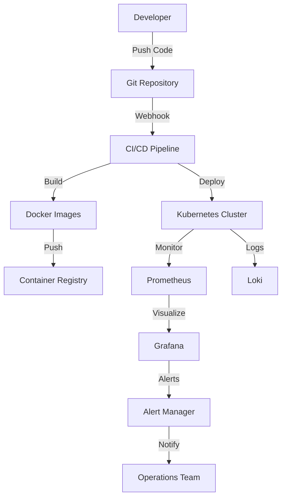
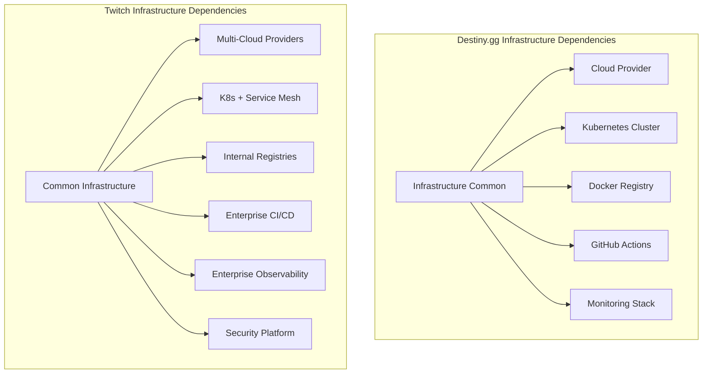

# Infrastructure Common (Shared Docker & Deployment)

## Purpose

**Category**: Essential

The Infrastructure Common component serves as **destiny.gg's foundational deployment and operational infrastructure**, providing shared Docker configurations, deployment pipelines, monitoring systems, and operational utilities across all destiny.gg services. This component ensures consistent deployment patterns, observability, and operational excellence throughout the platform.

As the operational foundation, Infrastructure Common enables rapid service deployment, standardized monitoring, centralized logging, and reliable scaling patterns that support the entire destiny.gg ecosystem.

## Key Files & Structure

```
/home/cinder/Documents/destiny.gg/infrastructure-common/ (Operations Foundation)
├── docker/                   # Docker configurations
│   ├── base-images/         # Base container images
│   │   ├── node-base/       # Node.js base image
│   │   ├── go-base/         # Go base image
│   │   ├── python-base/     # Python base image
│   │   └── nginx-base/      # NGINX base image
│   ├── compose/             # Docker Compose configurations
│   │   ├── development.yml  # Local development environment
│   │   ├── testing.yml      # Testing environment setup
│   │   └── production.yml   # Production environment template
│   └── scripts/             # Docker utility scripts
│       ├── build.sh         # Image building automation
│       ├── push.sh          # Registry push automation
│       └── cleanup.sh       # Image cleanup utilities
├── kubernetes/               # Kubernetes deployment manifests
│   ├── base/                # Base Kubernetes resources
│   │   ├── namespace.yaml   # Namespace definitions
│   │   ├── configmap.yaml   # Configuration management
│   │   └── secrets.yaml     # Secret management templates
│   ├── services/            # Service-specific manifests
│   │   ├── strims/          # Strims backend deployment
│   │   ├── chat-gui/        # Chat GUI deployment
│   │   ├── modbot/          # ModBot deployment
│   │   └── auth/            # Authentication service deployment
│   ├── monitoring/          # Monitoring stack
│   │   ├── prometheus/      # Prometheus configuration
│   │   ├── grafana/         # Grafana dashboard configs
│   │   └── alertmanager/    # Alert management
│   └── ingress/             # Traffic routing configuration
│       ├── nginx-ingress.yaml    # NGINX ingress controller
│       └── ssl-certificates.yaml # SSL certificate management
├── monitoring/               # Observability configurations
│   ├── prometheus/          # Metrics collection
│   │   ├── prometheus.yml   # Main Prometheus configuration
│   │   ├── rules/           # Alerting rules
│   │   └── targets/         # Service discovery configs
│   ├── grafana/             # Dashboards and visualization
│   │   ├── dashboards/      # Pre-built dashboards
│   │   ├── datasources/     # Data source configurations
│   │   └── provisioning/    # Automated provisioning
│   ├── loki/                # Log aggregation
│   │   ├── loki.yml         # Loki configuration
│   │   └── promtail.yml     # Log shipping configuration
│   └── jaeger/              # Distributed tracing
│       └── jaeger.yml       # Tracing configuration
├── ci-cd/                   # CI/CD pipeline configurations
│   ├── github-actions/      # GitHub Actions workflows
│   │   ├── build.yml        # Build and test pipeline
│   │   ├── deploy.yml       # Deployment pipeline
│   │   └── security.yml     # Security scanning
│   ├── scripts/             # Deployment automation
│   │   ├── deploy.sh        # Deployment orchestration
│   │   ├── rollback.sh      # Rollback procedures
│   │   └── health-check.sh  # Health verification
│   └── templates/           # Configuration templates
│       ├── env.template     # Environment variable templates
│       └── config.template  # Service configuration templates
├── terraform/               # Infrastructure as Code
│   ├── modules/             # Reusable Terraform modules
│   │   ├── database/        # Database provisioning
│   │   ├── networking/      # Network infrastructure
│   │   └── storage/         # Storage solutions
│   ├── environments/        # Environment-specific configs
│   │   ├── development/     # Development infrastructure
│   │   ├── staging/         # Staging environment
│   │   └── production/      # Production infrastructure
│   └── providers/           # Cloud provider configurations
├── scripts/                 # Operational scripts
│   ├── backup.sh            # Database backup automation
│   ├── restore.sh           # Database restoration
│   ├── ssl-renewal.sh       # SSL certificate renewal
│   └── log-rotation.sh      # Log management
├── config/                  # Shared configuration files
│   ├── logging.yml          # Centralized logging configuration
│   ├── metrics.yml          # Metrics collection settings
│   └── security.yml         # Security policy configurations
└── docs/                    # Infrastructure documentation
    ├── deployment-guide.md  # Deployment procedures
    ├── monitoring-guide.md  # Monitoring setup guide
    └── troubleshooting.md   # Common issue resolution
```

## Interfaces

### Docker & Container Management
- **Base Image Registry**: Standardized container images for all services
- **Multi-stage Builds**: Optimized build processes for different environments
- **Health Checks**: Container health monitoring and automatic restarts
- **Resource Limits**: CPU and memory constraints for efficient resource usage

### Deployment Pipeline
- **Automated CI/CD**: GitHub Actions integration for continuous deployment
- **Environment Promotion**: Development → Staging → Production pipeline
- **Blue/Green Deployments**: Zero-downtime deployment strategies
- **Rollback Mechanisms**: Automated rollback on deployment failures

### Monitoring & Observability
- **Prometheus Metrics**: Service metrics collection and alerting
- **Grafana Dashboards**: Real-time performance visualization
- **Centralized Logging**: Log aggregation with Loki/ELK stack
- **Distributed Tracing**: Request tracing across microservices

### Infrastructure as Code
- **Terraform Modules**: Reusable infrastructure components
- **Environment Management**: Consistent infrastructure across environments
- **Resource Provisioning**: Automated cloud resource management
- **State Management**: Terraform state handling and backup

## Depends On

### Cloud Infrastructure
- **AWS/GCP/Azure** - Primary cloud provider for hosting and services
- **Kubernetes Cluster** - Container orchestration platform
- **Container Registry** - Docker image storage and distribution
- **Load Balancers** - Traffic distribution and SSL termination

### Third-party Services
- **GitHub Actions** - CI/CD pipeline execution
- **Docker Hub/ECR** - Container image registry
- **DNS Provider** - Domain name management
- **SSL Certificate Authority** - HTTPS certificate provisioning

### Monitoring Stack
- **Prometheus** - Metrics collection and storage
- **Grafana** - Metrics visualization and dashboards
- **Loki/ELK** - Log aggregation and search
- **Jaeger/Zipkin** - Distributed tracing (optional)

### Development Tools
- **Terraform** - Infrastructure provisioning and management
- **Helm** - Kubernetes package management (optional)
- **Git** - Version control for infrastructure code
- **Secrets Management** - HashiCorp Vault or cloud-native solutions

## Used By

### All destiny.gg Services
- **[[destiny.gg Docs/Components/Essential/Web/Backend/strims]]** - Deployment, monitoring, and operational support
- **[[destiny.gg Docs/Components/Essential/Chat/Frontend/chat-gui]]** - Container deployment and static asset serving
- **[[destiny.gg Docs/Components/Essential/Web/Backend/modbot]]** - ML model deployment and monitoring infrastructure
- **[[destiny.gg Docs/Components/Essential/Web/Backend/authentication]]** - Secure deployment and certificate management

### Development Teams
- **Backend Developers** - Standardized deployment patterns and monitoring
- **Frontend Developers** - Asset building and CDN integration
- **DevOps Engineers** - Infrastructure management and automation
- **Site Reliability** - Operational monitoring and incident response

### External Dependencies
- **Third-party Integrations** - Webhook endpoints and API monitoring
- **CDN Services** - Static asset delivery optimization
- **Backup Services** - Data backup and disaster recovery

## Architecture

### Layered Infrastructure Architecture
- **Base Layer**: Docker images and container standards
- **Orchestration Layer**: Kubernetes deployment and service mesh
- **Observability Layer**: Monitoring, logging, and tracing
- **Automation Layer**: CI/CD pipelines and infrastructure as code

### Deployment Architecture


### Multi-Environment Architecture
- **Development**: Local Docker Compose with hot reloading
- **Staging**: Kubernetes cluster with production-like configuration
- **Production**: Highly available Kubernetes with monitoring and backup

## Cross-Analysis

### Architecture Comparison with [[Components/Essential/Infrastructure/Core/common|Twitch Common Infrastructure]]

**Similarities:**
- Containerized deployment with Docker and Kubernetes
- Comprehensive monitoring with Prometheus and Grafana
- Infrastructure as code with Terraform/similar tools
- CI/CD pipeline automation for consistent deployments
- Centralized logging and distributed tracing capabilities

**Key Differences:**
- **Scale**: Community-focused infrastructure vs global platform requirements
- **Complexity**: Single-region deployment vs multi-region distributed architecture
- **Team Size**: Small team operations vs large engineering organization
- **Compliance**: Basic security vs enterprise compliance requirements
- **Cost Optimization**: Budget-conscious choices vs performance-first approach

### Technology Stack Comparison

| Component | Destiny.gg Infrastructure | Twitch Common Infrastructure |
|-----------|---------------------------|------------------------------|
| **Orchestration** | Kubernetes | Kubernetes + Service Mesh |
| **Monitoring** | Prometheus + Grafana | Prometheus + DataDog + Custom |
| **Logging** | Loki + Promtail | ELK Stack + Custom Solutions |
| **CI/CD** | GitHub Actions | Jenkins + Custom Pipelines |
| **IaC** | Terraform | Terraform + Custom Tooling |
| **Container Registry** | Docker Hub/ECR | Internal Registry Systems |

### Scaling Characteristics

**Destiny.gg Infrastructure:**
- **Services**: 5-10 containerized microservices
- **Environments**: 3 environments (dev/staging/prod)
- **Deployment Frequency**: Daily deployments during active development
- **Monitoring Targets**: 20-50 monitored endpoints
- **Infrastructure**: Single cloud region with basic redundancy

**Twitch Common Infrastructure:**
- **Services**: Hundreds of microservices across domains
- **Environments**: Multiple environments per service with global distribution
- **Deployment Frequency**: Thousands of deployments per day
- **Monitoring Targets**: Thousands of services and endpoints
- **Infrastructure**: Multi-region with complex disaster recovery

### Dependency Graph Comparison



**Architectural Trade-offs:**
- **Destiny.gg**: Simpler infrastructure enables faster iteration and lower operational overhead
- **Twitch**: Complex infrastructure supports massive scale but requires dedicated platform teams

## Notes

**Operational Excellence:**
- **99.5% uptime** target for production services
- **<30 second** deployment time for typical service updates
- **5-minute** rollback capability for deployment issues
- **24/7 monitoring** with automated alerting for critical issues

**Development Experience:**
- **One-command deployment** from development to production
- **Consistent environments** reducing "works on my machine" issues
- **Automated testing** integration with deployment pipelines
- **Local development** closely matching production environment

**Cost Optimization:**
- **Resource right-sizing** based on actual usage patterns
- **Auto-scaling** during peak chat activity and events
- **Spot instances** for non-critical workloads
- **Resource monitoring** to identify optimization opportunities

**Security and Compliance:**
- **Container scanning** for vulnerability detection
- **Secrets management** with encrypted storage and rotation
- **Network policies** restricting inter-service communication
- **Audit logging** for all infrastructure changes

**Disaster Recovery:**
- **Automated backups** with point-in-time recovery
- **Infrastructure replication** capability across availability zones
- **Runbook documentation** for common incident scenarios
- **Recovery testing** with regular disaster recovery drills

**Future Scalability:**
- **Multi-region deployment** preparation for global audience
- **Service mesh** integration for advanced traffic management
- **Advanced monitoring** with predictive alerting
- **Infrastructure cost optimization** with usage-based scaling

**TODO Items:**
- Implement advanced security scanning in CI/CD pipeline
- Add chaos engineering practices for resilience testing
- Integrate infrastructure cost monitoring and optimization
- Develop self-healing capabilities for common failure scenarios
- Implement advanced deployment strategies (canary, feature flags)

## Backlinks

- Back to source: [[/home/cinder/Documents/destiny.gg/infrastructure-common]]
- Coverage tracking: [[Coverage]]
- Main index: [[Index]]
- Used by: [[Components/strims]], [[Components/chat-gui]], [[Components/modbot]], [[Components/authentication]]
- Cross-reference: [[Components/Essential/Infrastructure/Core/common]]

<!-- Code annotation: Created destiny.gg infrastructure-common component card with cross-analysis comparing to Twitch Common Infrastructure. Includes deployment pipeline architecture and Kubernetes/Docker patterns as requested in Step 5. -->
