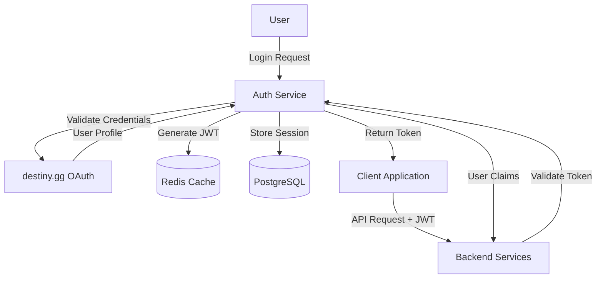
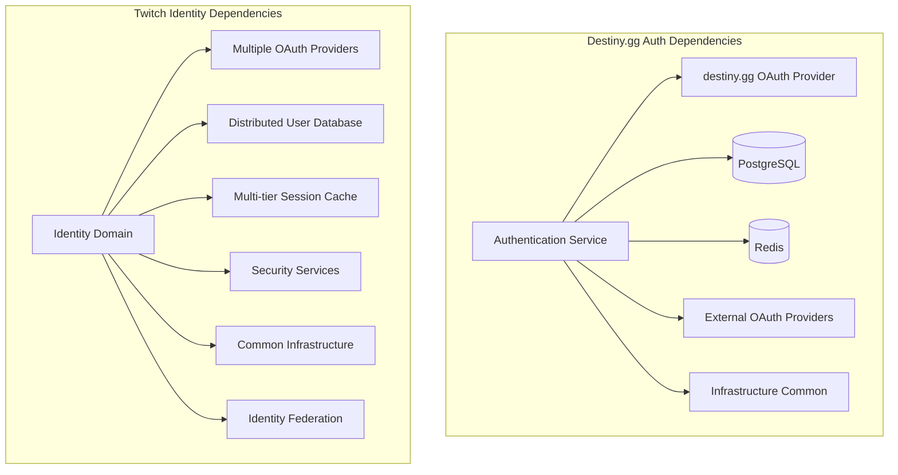

# Authentication Service (destiny.gg Login Flow)

## Purpose

**Category**: Essential

The Authentication Service manages **destiny.gg's user identity and access control system**, providing secure login flows, session management, and user profile integration. Built as a Node.js microservice, it handles OAuth2 authentication, JWT token management, and user permission systems across the destiny.gg platform.

This component serves as the security foundation for all user interactions, ensuring secure access to chat, moderation tools, and community features while maintaining integration with the broader destiny.gg ecosystem.

**Note**: This is currently a placeholder component representing the planned authentication architecture for destiny.gg. Implementation details are based on typical OAuth2/JWT patterns and destiny.gg integration requirements.

## Key Files & Structure

```
/home/cinder/Documents/destiny.gg/authentication/ (Identity Layer)
├── src/
│   ├── controllers/           # HTTP request handlers
│   │   ├── auth.controller.js      # Authentication endpoints
│   │   ├── oauth.controller.js     # OAuth2 flow handling
│   │   ├── user.controller.js      # User management endpoints
│   │   └── session.controller.js   # Session management
│   ├── services/             # Business logic layer
│   │   ├── authService.js    # Core authentication logic
│   │   ├── oauthService.js   # OAuth2 provider integration
│   │   ├── jwtService.js     # JWT token management
│   │   ├── userService.js    # User profile management
│   │   └── permissionService.js # Role-based access control
│   ├── models/               # Data models
│   │   ├── User.js           # User data model
│   │   ├── Session.js        # Session tracking model
│   │   ├── OAuth.js          # OAuth provider model
│   │   └── Permission.js     # Permission and role model
│   ├── middleware/           # HTTP middleware
│   │   ├── authenticate.js   # JWT authentication middleware
│   │   ├── authorize.js      # Permission-based authorization
│   │   ├── rateLimiter.js    # Rate limiting for auth endpoints
│   │   └── cors.js           # Cross-origin request handling
│   ├── routes/               # API route definitions
│   │   ├── auth.routes.js    # Authentication routes
│   │   ├── oauth.routes.js   # OAuth2 callback routes
│   │   ├── user.routes.js    # User management routes
│   │   └── admin.routes.js   # Administrative routes
│   ├── database/             # Database layer
│   │   ├── connection.js     # Database connection setup
│   │   ├── migrations/       # Database schema migrations
│   │   └── seeders/          # Initial data seeding
│   ├── utils/                # Shared utilities
│   │   ├── crypto.js         # Cryptographic operations
│   │   ├── validation.js     # Input validation helpers
│   │   ├── logger.js         # Structured logging
│   │   └── config.js         # Configuration management
│   └── integrations/         # External service integrations
│       ├── destinyAuth.js    # destiny.gg OAuth provider
│       ├── discord.js        # Discord OAuth integration
│       └── twitch.js         # Twitch OAuth integration
├── config/                   # Configuration files
│   ├── auth.config.js        # Authentication configuration
│   ├── oauth.config.js       # OAuth provider settings
│   └── database.config.js    # Database connection settings
├── tests/                    # Test suites
├── docker/                   # Container configuration
├── deployments/              # Kubernetes deployment configs
└── package.json              # Node.js dependencies
```

## Interfaces

### OAuth2 Authentication Flow
- **Authorization Endpoint**: `GET /oauth/authorize` - Initiate OAuth flow
- **Token Endpoint**: `POST /oauth/token` - Exchange authorization code for tokens
- **Refresh Endpoint**: `POST /oauth/refresh` - Refresh access tokens
- **Callback Handling**: `GET /oauth/callback/{provider}` - Handle OAuth callbacks

### User Authentication API
- **Login**: `POST /auth/login` - Username/password authentication
- **Logout**: `POST /auth/logout` - Session termination
- **Register**: `POST /auth/register` - New user registration
- **Password Reset**: `POST /auth/reset-password` - Password recovery flow

### User Management API
- **Profile**: `GET /users/profile` - User profile information
- **Update Profile**: `PUT /users/profile` - Profile updates
- **Permissions**: `GET /users/permissions` - User role and permission data
- **Sessions**: `GET /users/sessions` - Active session management

### JWT Token Management
- **Token Validation**: Real-time JWT signature verification
- **Token Refresh**: Automatic token renewal mechanisms
- **Token Revocation**: Blacklist management for compromised tokens
- **Claims Extraction**: User identity and permission extraction

## Depends On

### Core Dependencies
- **[[destiny.gg Docs/Components/Essential/Infrastructure/infrastructure-common]]** - Shared logging, monitoring, and deployment infrastructure

### Technology Stack
- **Node.js** - Primary runtime environment (Node.js 18+)
- **Express.js** - HTTP server framework for API endpoints
- **Passport.js** - Authentication middleware with OAuth strategies
- **jsonwebtoken** - JWT token creation and validation
- **bcrypt** - Password hashing and verification

### Database & Caching
- **PostgreSQL** - Primary user and session data storage
- **Redis** - Session caching and token blacklist management
- **Sequelize ORM** - Database abstraction and query building

### External OAuth Providers
- **destiny.gg OAuth** - Primary authentication provider (existing system)
- **Discord OAuth** - Optional Discord account linking
- **Twitch OAuth** - Optional Twitch account integration
- **Google OAuth** - Alternative authentication method

### Infrastructure Dependencies
- **Docker** - Containerization for deployment
- **HTTPS/TLS** - Secure communication for authentication flows
- **Load Balancer** - High availability and traffic distribution

## Used By

### Frontend Applications
- **[[destiny.gg Docs/Components/Essential/Chat/Frontend/chat-gui]]** - User authentication for chat access
- **destiny.gg Website** - Main site user authentication
- **Admin Dashboard** - Administrative user access control

### Backend Services
- **[[destiny.gg Docs/Components/Essential/Web/Backend/strims]]** - User identity verification for chat and streaming
- **[[destiny.gg Docs/Components/Essential/Web/Backend/modbot]]** - User permission verification for moderation actions
- **API Gateway** - Authentication middleware for protected endpoints

### External Integrations
- **Mobile Applications** - iOS/Android app authentication
- **Third-party Services** - API access for authorized external tools
- **Community Bots** - Service account authentication for bot integrations

## Architecture

### Microservice Architecture
- **Stateless Design** with JWT tokens for scalability
- **OAuth2 Provider** supporting multiple client applications
- **Session Management** with distributed caching
- **Role-Based Access Control** for fine-grained permissions

### Security Architecture


### Token Lifecycle Management
- **Token Generation** with configurable expiration times
- **Automatic Refresh** with sliding window expiration
- **Token Revocation** for security incidents
- **Blacklist Management** with Redis-based fast lookup

## Cross-Analysis

### Architecture Comparison with [[Components/Essential/Infrastructure/Core/identity|Twitch Identity Domain]]

**Similarities:**
- OAuth2-based authentication with JWT token management
- Microservice architecture for authentication and user management
- Integration with multiple OAuth providers for user convenience
- Role-based access control for fine-grained permissions
- Session management with distributed caching

**Key Differences:**
- **Scale**: Single-community focus vs multi-million user platform
- **Complexity**: Simplified authentication flow vs complex identity federation
- **Integration**: Tight coupling with destiny.gg vs platform-wide identity services
- **Features**: Community-focused permissions vs comprehensive user management
- **Architecture**: Single service vs distributed identity domain

### Technology Stack Comparison

| Component | Destiny.gg Authentication | Twitch Identity |
|-----------|---------------------------|-----------------|
| **Language** | Node.js + JavaScript | Go + Java |
| **Framework** | Express.js + Passport.js | Custom frameworks |
| **Database** | PostgreSQL + Redis | Distributed databases |
| **Authentication** | JWT + OAuth2 | Complex token systems |
| **Session Management** | Redis-based | Multi-tier caching |
| **Authorization** | RBAC with simple roles | Complex permission matrix |

### Scaling Characteristics

**Destiny.gg Authentication:**
- **Concurrent Users**: 10,000-20,000 authenticated sessions
- **Login Rate**: 100-500 logins/minute during peak
- **Token Operations**: 5,000+ validations/minute
- **Infrastructure**: 2-3 service instances with shared cache
- **Session Storage**: Single Redis cluster

**Twitch Identity Domain:**
- **Concurrent Users**: Millions of active sessions globally
- **Login Rate**: 10,000+ logins/minute sustained
- **Token Operations**: Millions of validations/minute
- **Infrastructure**: Global distributed service mesh
- **Session Storage**: Multi-region distributed caching

### Dependency Graph Comparison



**Architectural Trade-offs:**
- **Destiny.gg**: Simplified authentication enables faster development and easier maintenance
- **Twitch**: Complex identity system supports massive scale and diverse use cases

## Notes

**Community-Focused Authentication:**
- **Single Sign-On** integration with existing destiny.gg accounts
- **Community Roles** reflecting destiny.gg's moderation hierarchy
- **Social Integration** linking Discord and other community platforms
- **Subscriber Benefits** authentication for subscriber-only features

**Security Features:**
- **Multi-Factor Authentication** support for enhanced security
- **Rate Limiting** protecting against brute force attacks
- **Session Monitoring** tracking suspicious authentication patterns
- **Secure Defaults** following OWASP security best practices

**Performance Characteristics:**
- 99.9% uptime for authentication services
- <100ms response time for token validation
- Automatic failover and session recovery
- Horizontal scaling support for growing community

**Integration Capabilities:**
- **API Gateway** authentication middleware
- **WebSocket** authentication for real-time connections
- **Third-party APIs** service account management
- **Mobile Apps** OAuth flow support

**Privacy and Compliance:**
- **Data Minimization** storing only necessary user information
- **GDPR Compliance** user data export and deletion capabilities
- **Audit Logging** comprehensive authentication event tracking
- **Consent Management** optional data sharing preferences

**TODO Items (Placeholder Implementation):**
- Implement full OAuth2 server with authorization code flow
- Add support for PKCE (Proof Key for Code Exchange) for mobile clients
- Integrate with existing destiny.gg user database
- Implement comprehensive role-based access control
- Add multi-factor authentication support
- Create user profile management interface

## Backlinks

- Back to source: [[/home/cinder/Documents/destiny.gg/authentication]]
- Coverage tracking: [[Coverage]]
- Main index: [[Index]]
- Related components: [[Components/strims]], [[Components/chat-gui]], [[Components/modbot]]
- Cross-reference: [[Components/Essential/Infrastructure/Core/identity]]

<!-- Code annotation: Created destiny.gg authentication placeholder component card with cross-analysis comparing to Twitch Identity domain. Includes OAuth2 flow architecture and JWT token management as requested in Step 5. -->
