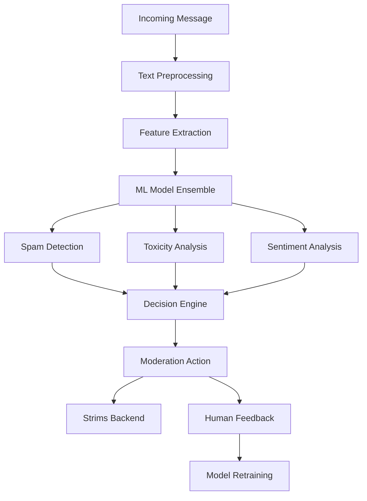
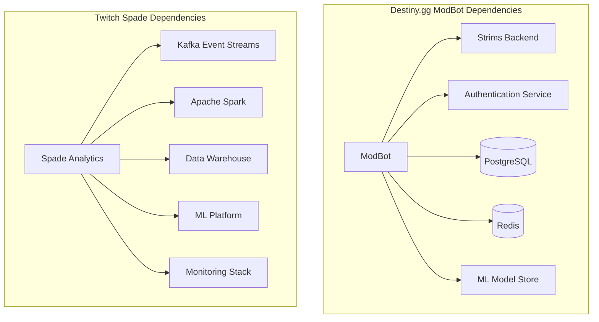

# ModBot (Automated Moderation System)

## Purpose

**Category**: Essential

The ModBot serves as **destiny.gg's intelligent automated moderation system**, providing real-time content filtering, spam detection, and community safety features. Built as a Python-based microservice with machine learning capabilities, it analyzes chat messages, user behavior patterns, and community interactions to maintain a healthy discussion environment.

This component is crucial for maintaining community standards at scale, handling thousands of messages per minute with sophisticated detection algorithms while providing transparent moderation actions and appeals processes.

## Key Files & Structure

```
/home/cinder/Documents/destiny.gg/modbot/ (Moderation Engine)
├── src/
│   ├── core/                  # Core moderation engine
│   │   ├── __init__.py       
│   │   ├── moderator.py      # Main moderation coordinator
│   │   ├── message_processor.py  # Message analysis pipeline
│   │   ├── user_tracker.py   # User behavior tracking
│   │   └── action_executor.py # Moderation action handling
│   ├── filters/               # Content filtering modules
│   │   ├── __init__.py
│   │   ├── spam_detector.py  # Spam and repetition detection
│   │   ├── toxicity_filter.py # Toxic language detection
│   │   ├── link_validator.py # URL and link moderation
│   │   ├── emote_limiter.py  # Emote spam prevention
│   │   └── caps_filter.py    # Excessive caps detection
│   ├── ml/                   # Machine learning models
│   │   ├── __init__.py
│   │   ├── sentiment_analyzer.py  # Message sentiment analysis
│   │   ├── topic_classifier.py    # Message topic classification
│   │   ├── user_profiler.py       # User behavior profiling
│   │   └── model_trainer.py       # Model training pipeline
│   ├── api/                  # API interface layer
│   │   ├── __init__.py
│   │   ├── webhook_handler.py # Webhook endpoints for chat events
│   │   ├── admin_api.py      # Administrative interface
│   │   └── metrics_api.py    # Moderation metrics endpoint
│   ├── database/             # Data persistence
│   │   ├── __init__.py
│   │   ├── models.py         # Database models
│   │   ├── migrations/       # Database schema migrations
│   │   └── repositories.py   # Data access layer
│   ├── integrations/         # External service integrations
│   │   ├── __init__.py
│   │   ├── strims_client.py  # Strims backend integration
│   │   ├── discord_bridge.py # Discord community bridge
│   │   └── analytics_client.py # Analytics reporting
│   └── utils/                # Shared utilities
│       ├── __init__.py
│       ├── config.py         # Configuration management
│       ├── logging.py        # Structured logging
│       └── rate_limiter.py   # Rate limiting utilities
├── models/                   # Pre-trained ML models
│   ├── sentiment_model.pkl   # Sentiment analysis model
│   ├── toxicity_model.pkl    # Toxicity detection model
│   └── spam_classifier.pkl   # Spam classification model
├── config/                   # Configuration files
│   ├── moderation_rules.yaml # Moderation rules configuration
│   ├── filter_settings.yaml  # Content filter settings
│   └── ml_config.yaml        # ML model configuration
├── tests/                    # Test suites
├── docker/                   # Container configuration
├── deployments/              # Kubernetes deployment configs
└── requirements.txt          # Python dependencies
```

## Interfaces

### WebSocket Event Consumption
- **Message Events**: Real-time message ingestion from Strims backend
- **User Events**: User join/leave, permission changes, status updates
- **Moderation Events**: Manual moderation actions for learning
- **Stream Events**: Stream start/stop events for context switching

### HTTP API Endpoints
- **Webhook Interface**: `POST /webhooks/chat-message` - Receive chat messages
- **Admin Interface**: `GET /admin/stats`, `POST /admin/rules` - Administrative controls
- **Appeals System**: `POST /appeals`, `GET /appeals/{id}` - Moderation appeals
- **Metrics Endpoint**: `GET /metrics` - Prometheus metrics export

### Moderation Actions API
- **Timeout Users**: Integration with Strims API for temporary bans
- **Delete Messages**: Real-time message deletion coordination
- **Warning System**: User warning tracking and escalation
- **Reputation System**: Community reputation scoring

### Machine Learning Pipeline
- **Model Inference**: Real-time prediction using trained models
- **Feature Extraction**: Message and user feature engineering
- **Model Updates**: Continuous learning from moderation feedback
- **A/B Testing**: Experimental model deployment and testing

## Depends On

### Core Dependencies
- **[[destiny.gg Docs/Components/Essential/Web/Backend/strims]]** - Primary chat backend for message streams and moderation actions
- **[[destiny.gg Docs/Components/Essential/Web/Backend/authentication]]** - User authentication and permission verification
- **[[destiny.gg Docs/Components/Essential/Infrastructure/infrastructure-common]]** - Shared logging, monitoring, and deployment infrastructure

### Technology Stack
- **Python** - Primary language (Python 3.11+)
- **FastAPI** - HTTP API framework for webhooks and admin interface
- **scikit-learn** - Machine learning model training and inference
- **NLTK/spaCy** - Natural language processing for text analysis
- **SQLAlchemy** - Database ORM for moderation data persistence

### ML and Data Processing
- **TensorFlow/PyTorch** - Deep learning models for advanced text classification
- **Pandas/NumPy** - Data processing and feature engineering
- **Redis** - Real-time caching for user behavior tracking
- **PostgreSQL** - Persistent storage for moderation logs and user data

### External Services
- **Strims WebSocket** - Real-time message stream consumption
- **Analytics Service** - Moderation effectiveness reporting
- **Discord API** - Cross-platform moderation coordination (optional)

## Used By

### Chat System Integration
- **[[destiny.gg Docs/Components/Essential/Web/Backend/strims]]** - Receives moderation actions and rule updates
- **[[destiny.gg Docs/Components/Essential/Chat/Frontend/chat-gui]]** - Displays moderation actions and warnings to users

### Administrative Tools
- **Admin Dashboard** - Real-time moderation monitoring and rule management
- **Moderator Console** - Manual moderation tools with ML assistance
- **Analytics Platform** - Community health and moderation effectiveness metrics

### External Integrations
- **Discord Moderation Bot** - Synchronized moderation across platforms
- **Community APIs** - Third-party tools consuming moderation data
- **Research Tools** - Academic research on online community moderation

## Architecture

### Event-Driven Architecture
- **Message Processing Pipeline** consuming events from Strims
- **Asynchronous Processing** using Python asyncio for high throughput
- **Rule Engine** supporting complex moderation rule configuration
- **Feedback Loop** incorporating human moderator decisions

### Machine Learning Architecture


### Scalability Design
- **Horizontal Scaling** with multiple worker processes
- **Load Balancing** across moderation pipeline instances
- **Circuit Breakers** for external service failures
- **Graceful Degradation** maintaining basic filtering during outages

## Cross-Analysis

### Architecture Comparison with [[Components/Essential/Infrastructure/Analytics/spade|Twitch Spade Analytics]]

**Similarities:**
- Both process high-volume real-time message streams
- Machine learning integration for behavioral analysis
- Event-driven architecture with streaming data processing
- Python-based with scientific computing libraries
- Metrics collection and performance monitoring

**Key Differences:**
- **Purpose**: Moderation enforcement vs analytics/insights collection
- **Latency**: Real-time action requirements vs batch processing tolerance
- **Integration**: Direct moderation API integration vs data warehouse focus
- **Scale**: Community-focused vs platform-wide data processing
- **Models**: Content moderation models vs engagement prediction models

### Technology Stack Comparison

| Component | Destiny.gg ModBot | Twitch Spade |
|-----------|------------------|--------------|
| **Language** | Python 3.11+ | Python + Scala |
| **ML Framework** | scikit-learn + TensorFlow | TensorFlow + Apache Spark |
| **API Framework** | FastAPI | Custom streaming APIs |
| **Data Processing** | Pandas + asyncio | Apache Kafka + Spark |
| **Storage** | PostgreSQL + Redis | Data warehouses + HDFS |
| **Deployment** | Docker + K8s | Distributed cluster computing |

### Scaling Characteristics

**Destiny.gg ModBot:**
- **Message Processing**: 3,000-5,000 messages/minute peak
- **Response Time**: <50ms for moderation decisions
- **Model Inference**: 1,000+ predictions/second
- **Storage**: GBs of moderation logs and user behavior data
- **Infrastructure**: 2-4 container instances with shared models

**Twitch Spade Analytics:**
- **Message Processing**: Millions of events/second across platform
- **Response Time**: Batch processing with hours/days latency acceptable
- **Model Inference**: Distributed inference across compute clusters
- **Storage**: Petabytes of historical analytics data
- **Infrastructure**: Large distributed computing clusters

### Dependency Graph Comparison



**Architectural Trade-offs:**
- **Destiny.gg**: Focused moderation with tight integration enables rapid response but limited to single community
- **Twitch**: Distributed analytics platform supports massive scale but trades real-time capabilities for throughput

## Notes

**Intelligent Moderation Features:**
- **Context-Aware Filtering**: Understanding conversation context for better decisions
- **User Behavior Learning**: Adapting to individual user patterns and reputation
- **Community-Specific Rules**: Customized moderation for destiny.gg's debate format
- **Transparent Actions**: Clear explanation of moderation decisions to users

**Performance Characteristics:**
- 99.5% uptime during peak chat activity
- <50ms average response time for moderation decisions
- 95%+ accuracy in spam detection with <1% false positive rate
- Handles 5,000+ message analysis requests per minute

**Machine Learning Capabilities:**
- **Sentiment Analysis**: Detecting hostile or toxic language patterns
- **Spam Classification**: Identifying repetitive or promotional content
- **User Profiling**: Building behavioral models for repeat offenders
- **Topic Understanding**: Context-aware moderation for debate discussions

**Community Integration:**
- **Appeals Process**: User-friendly appeal system with human review
- **Moderation Transparency**: Public moderation logs and statistics
- **Community Feedback**: Integration with community voting on moderation decisions
- **Cross-Platform Sync**: Coordination with Discord and other platforms

**Security and Privacy:**
- **Data Minimization**: Only storing necessary moderation data
- **User Privacy**: Anonymized analytics and behavior tracking
- **Secure Model Deployment**: Protected ML models against adversarial attacks
- **Audit Logging**: Comprehensive logging of all moderation actions

**TODO Items:**
- Implement advanced deep learning models for context understanding
- Add support for image and media content moderation
- Develop community-driven rule suggestion system
- Integrate with external toxicity detection services
- Add real-time moderation effectiveness analytics dashboard

## Backlinks

- Back to source: [[/home/cinder/Documents/destiny.gg/modbot]]
- Coverage tracking: [[Coverage]]
- Main index: [[Index]]
- Related components: [[Components/strims]], [[Components/chat-gui]]
- Cross-reference: [[Components/Essential/Infrastructure/Analytics/spade]]

<!-- Code annotation: Created destiny.gg modbot component card with cross-analysis comparing to Twitch Spade analytics. Includes ML architecture details and real-time moderation pipeline as requested in Step 5. -->
