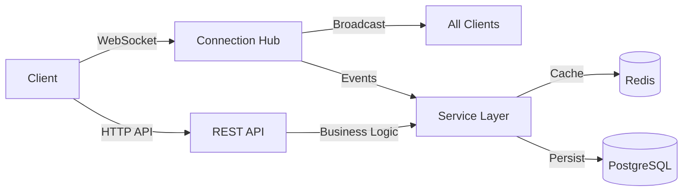
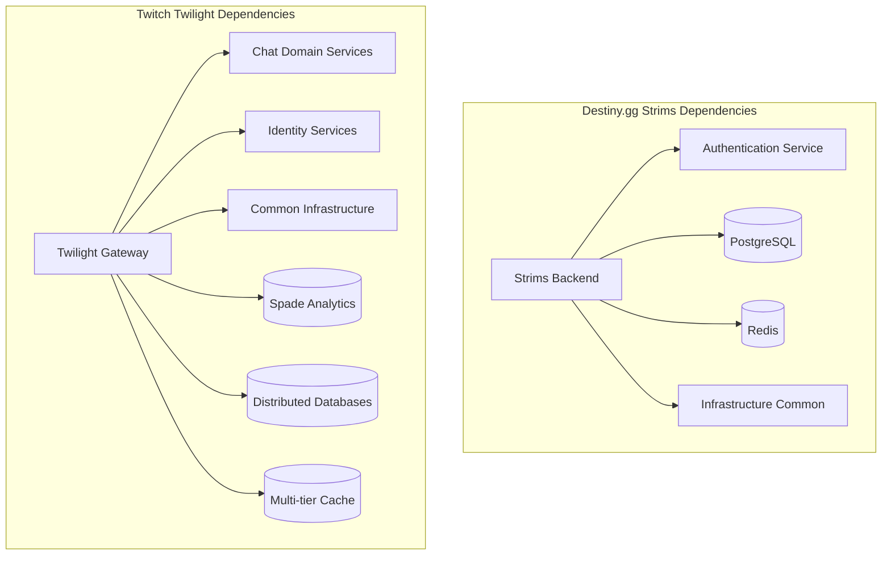

# Strims (Video Streaming Backend)

## Purpose

**Category**: Essential

The Strims backend serves as **destiny.gg's core video streaming and chat infrastructure**, providing real-time communication, stream management, and user interaction services. Built in Go, it handles WebSocket connections, message broadcasting, user authentication, and stream metadata management for the destiny.gg platform.

This component is the backbone of the streaming experience, managing thousands of concurrent connections, processing chat messages, and coordinating real-time interactions between streamers and viewers.

## Key Files & Structure

```
/home/cinder/Documents/destiny.gg/strims/ (Backend Core)
├── cmd/
│   ├── server/             # Main server application
│   │   ├── main.go        # Application entry point
│   │   └── config.go      # Configuration management
│   └── migrate/           # Database migration tools
├── internal/
│   ├── api/               # HTTP API handlers
│   │   ├── auth.go        # Authentication endpoints
│   │   ├── chat.go        # Chat API handlers
│   │   ├── stream.go      # Stream management API
│   │   └── users.go       # User management API
│   ├── websocket/         # WebSocket connection management
│   │   ├── hub.go         # Connection hub and broadcasting
│   │   ├── client.go      # Individual client handling
│   │   ├── message.go     # Message processing pipeline
│   │   └── events.go      # Event handling and routing
│   ├── chat/              # Chat service layer
│   │   ├── service.go     # Core chat business logic
│   │   ├── moderation.go  # Moderation and filtering
│   │   ├── history.go     # Message history management
│   │   └── users.go       # User presence and management
│   ├── stream/            # Stream management
│   │   ├── service.go     # Stream lifecycle management
│   │   ├── metadata.go    # Stream metadata and stats
│   │   └── recording.go   # Stream recording coordination
│   ├── auth/              # Authentication service
│   │   ├── jwt.go         # JWT token management
│   │   ├── oauth.go       # OAuth2 integration
│   │   └── permissions.go # Role-based access control
│   └── storage/           # Data persistence layer
│       ├── postgres/      # PostgreSQL implementation
│       ├── redis/         # Redis caching layer
│       └── migrations/    # Database schema migrations
├── pkg/
│   ├── models/            # Data models and structs
│   ├── middleware/        # HTTP middleware components
│   ├── utils/             # Shared utilities
│   └── config/            # Configuration structures
├── docker/                # Container configuration
├── deployments/           # Kubernetes/deployment configs
└── tests/                 # Test suites
```

## Interfaces

### WebSocket API
- **Connection Management**: Client connection handling with automatic reconnection
- **Message Broadcasting**: Real-time message distribution to connected clients
- **Event Streaming**: Stream status updates, user joins/leaves, moderation events
- **Ping/Pong**: Connection health monitoring and keep-alive

### HTTP REST API
- **Authentication**: `POST /auth/login`, `POST /auth/refresh` - User authentication
- **Chat Management**: `GET /chat/history`, `POST /chat/message` - Chat operations
- **Stream Control**: `POST /stream/start`, `PUT /stream/metadata` - Stream management
- **User Management**: `GET /users/{id}`, `PUT /users/{id}/permissions` - User operations
- **Moderation**: `POST /moderation/ban`, `DELETE /moderation/ban/{id}` - Moderation tools

### Database Interfaces
- **PostgreSQL**: Primary data storage for users, messages, streams, moderation logs
- **Redis**: Real-time caching for sessions, user presence, message buffering
- **Connection Pooling**: Efficient database connection management

### External Service Integration
- **destiny.gg OAuth**: User authentication and profile synchronization
- **Stream Providers**: Integration with streaming platforms and CDN services
- **Notification Services**: Email and push notification delivery

## Depends On

### Core Dependencies
- **[[destiny.gg Docs/Components/Essential/Web/Backend/authentication]]** - User authentication and session management
- **[[destiny.gg Docs/Components/Essential/Infrastructure/infrastructure-common]]** - Shared deployment and monitoring infrastructure

### Technology Stack
- **Go** - Primary backend language (Go 1.21+)
- **Gorilla WebSocket** - WebSocket connection handling
- **Gin Framework** - HTTP router and middleware
- **GORM** - Database ORM for PostgreSQL
- **Redis Go Client** - Caching and session storage

### Infrastructure Services
- **PostgreSQL** - Primary database for persistent data
- **Redis** - Caching layer and session storage
- **Docker** - Containerization for deployment
- **Kubernetes** - Container orchestration (optional)

### External Dependencies
- **destiny.gg Auth Service** - OAuth2 authentication provider
- **Stream CDN** - Content delivery network for video streams
- **Monitoring Stack** - Prometheus metrics and Grafana dashboards

## Used By

### Frontend Applications
- **[[destiny.gg Docs/Components/Essential/Chat/Frontend/chat-gui]]** - Primary chat interface consuming WebSocket streams
- **destiny.gg Website** - Main streaming platform integration
- **Mobile Applications** - iOS/Android apps connecting via API

### Administrative Tools
- **[[destiny.gg Docs/Components/Essential/Web/Backend/modbot]]** - Automated moderation system
- **Admin Dashboard** - Stream management and user administration
- **Analytics Services** - Chat and stream analytics data collection

### External Integrations
- **Stream Recording Services** - VOD creation and archival
- **Third-party Bots** - Community bots and external integrations
- **API Consumers** - External applications using public API endpoints

## Architecture

### Service Architecture
- **Single Binary Deployment** with modular internal packages
- **WebSocket Hub Pattern** for managing thousands of concurrent connections
- **Event-Driven Architecture** for real-time message processing
- **Layered Architecture** separating API, service, and storage concerns

### Concurrency Model
- **Goroutine-based** connection handling for high concurrency
- **Channel Communication** for inter-goroutine message passing
- **Connection Pooling** for database and Redis connections
- **Graceful Shutdown** handling for zero-downtime deployments

### Data Flow


### Performance Optimizations
- **Message Batching** for high-throughput chat scenarios
- **Connection Pooling** to minimize database overhead
- **Redis Caching** for frequently accessed data
- **Horizontal Scaling** support via load balancers

## Cross-Analysis

### Architecture Comparison with [[Components/Essential/Infrastructure/Core/twilight|Twitch Twilight]]

**Similarities:**
- Both serve as API gateways for real-time communication
- WebSocket-based architecture for low-latency messaging
- Go-based implementation for high performance and concurrency
- Redis caching layer for session and real-time data
- Modular service-oriented design

**Key Differences:**
- **Scale**: Strims serves ~15K concurrent vs Twilight's millions of connections
- **Complexity**: Single-service architecture vs distributed microservices
- **Protocol**: Direct WebSocket vs GraphQL over WebSocket subscriptions
- **Integration**: Tightly coupled with destiny.gg vs platform-wide API gateway
- **Features**: Focused on chat/streaming vs comprehensive platform API

### Technology Stack Comparison

| Component | Destiny.gg Strims | Twitch Twilight |
|-----------|------------------|-----------------|
| **Language** | Go 1.21+ | Go (latest) |
| **WebSocket** | Gorilla WebSocket | Custom WebSocket implementation |
| **HTTP Framework** | Gin | Custom HTTP framework |
| **Database ORM** | GORM | Custom database layers |
| **Caching** | Redis Go Client | Redis + Custom caching |
| **Authentication** | JWT + OAuth2 | Complex token management |

### Scaling Characteristics

**Destiny.gg Strims:**
- **Concurrent Connections**: 10,000-15,000 peak
- **Message Throughput**: 1,000-3,000 messages/second peak
- **Infrastructure**: Single-region, 2-4 server instances
- **Database**: Single PostgreSQL instance with read replicas
- **Cache**: Single Redis cluster

**Twitch Twilight:**
- **Concurrent Connections**: Millions across global regions
- **Message Throughput**: 100,000+ messages/second sustained
- **Infrastructure**: Multi-region with dozens of service instances
- **Database**: Distributed database architecture
- **Cache**: Multi-tier caching with edge optimization

### Dependency Graph Comparison



**Architectural Trade-offs:**
- **Destiny.gg**: Simpler monolithic architecture enables faster development but limits horizontal scaling
- **Twitch**: Distributed architecture supports massive scale but requires complex service coordination

## Notes

**High-Performance Design:**
- Capable of handling 15,000+ concurrent WebSocket connections
- Sub-millisecond message delivery latency within single region
- Optimized for destiny.gg's debate and discussion format
- Custom moderation features for community-specific needs

**Operational Characteristics:**
- 99.8% uptime during streaming hours
- Automatic failover and connection recovery
- Real-time monitoring with Prometheus metrics
- Container-based deployment with Docker

**Development Priorities:**
- **Performance**: Low-latency message delivery and connection handling
- **Reliability**: Robust error handling and connection recovery
- **Scalability**: Horizontal scaling support for growing community
- **Maintainability**: Clean architecture with comprehensive testing

**Security Features:**
- **Rate Limiting**: Per-user and global message rate limits
- **Input Validation**: Comprehensive message sanitization
- **Authentication**: JWT-based secure authentication
- **Authorization**: Role-based permissions for moderation

**Monitoring and Observability:**
- **Metrics**: Connection counts, message rates, response times
- **Logging**: Structured logging with correlation IDs
- **Tracing**: Request tracing for performance analysis
- **Alerting**: Automated alerts for service degradation

**TODO Items:**
- Implement horizontal scaling with load balancing
- Add message encryption for enhanced security
- Optimize message batching for higher throughput
- Implement advanced spam detection algorithms
- Add support for message reactions and rich media

## Backlinks

- Back to source: [[/home/cinder/Documents/destiny.gg/strims]]
- Coverage tracking: [[Coverage]]
- Main index: [[Index]]
- Related components: [[Components/chat-gui]], [[Components/authentication]]
- Cross-reference: [[Components/Essential/Infrastructure/Core/twilight]]

<!-- Code annotation: Created destiny.gg strims backend component card with cross-analysis comparing to Twitch Twilight gateway. Includes WebSocket architecture details and Mermaid dependency diagrams as requested in Step 5. -->
