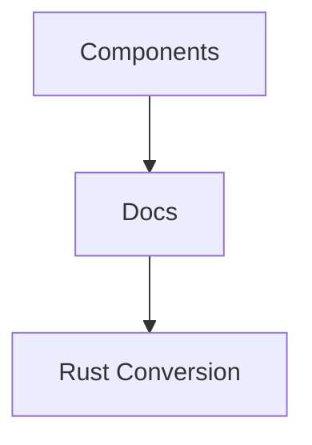

# Platform Analysis Docs

Repository: [platform-analysis-docs](../README.md)

## Quick Start / Setup
1. Clone the repo.
2. Install Python 3.
3. Run `python validate_backlinks.py` to verify documentation links.

## Architecture

## Usage
- Review component docs under `Components/` and `destiny.gg Docs/`.
- Consult `RUST CONVERSION/` for migration guides.

## Prerequisites
- Python 3
- Git

## Example Flow
1. Update a component doc.
2. Add or update its SPEC in `docs/spec/`.
3. Run `python validate_backlinks.py`.

## Contributing
See [AGENTS instructions](../AGENTS.md) for contribution guidelines.

## Backlinks
- [[../AGENTS.md]]
- [[../plan.md]]
- [[../toaster.md]]
- [[../README.md]]
- [[../CHANGELOG.md]]
- [[CHANGELOG.md]]
